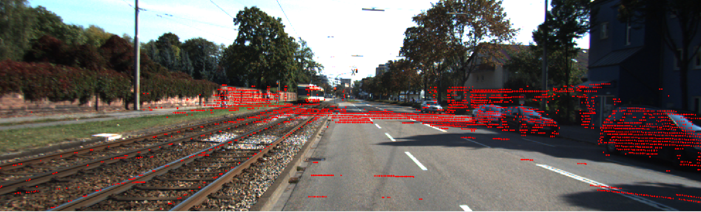

# ManualCamera2LidarCalib
Manual framework to calibrate a camera to lidar extrinsics. This repository is meant for self-educational purposes to understand basic process of 3D-projection to 2D image, and to learn how to use pangolin with python.




# How to run

```
python3 calib.py <bagfile> <image_topic> <pointcloud_topic> 
```


## Calibration

Calibration is done by projecting the lidar data to camera image (Intrinsics known). In the window user can adjust the extrsinsics parameters between the camera (optical frame) and LiDAR. The intensity can be used for down-sampling the lidar data for visualization to see more prominant features in the lidar. 


## Visualization 
Visualization uses the pangolin python inteface to show the image and pointcloud. Control of the extrinsic parameters can be also used in the window.

## TODO

Make the system more modular:
* Adjust the window size size to match the image (Currently fixed size for KITTI datasets)
* Add the intrinsics to be a loadable parameter (Hard-coded currently)
